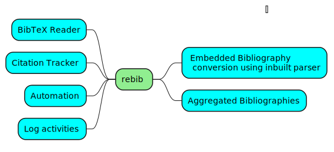

```{r, include = FALSE}
knitr::opts_chunk$set(
  collapse = TRUE,
  comment = "#>"
)
```

```{r setup, echo=FALSE}
library(rebib)
```


rebib is a spun-off package from [texor](https://github.com/Abhi-1U/texor).

The decision to do this is the fact that the bibliography section 
in texor package was expanding significantly, enough to deserve a dedicated space.

Thus rebib was born and has improved over the past few months to include more advanced features and utilities. 

## What does rebib do?

In LaTeX, we have multiple ways to declare bibliography entries, which include embedding bibliography entries in the document itself or isolating that section to an external file commonly called a bbl file. Then we have the BibTeX format, which has its structure and is much superior in managing bibliographic entries.

LaTeX has no problem dealing with multiple formats and works well with all these bibliographic formats. However, some web publishing journals like RJ web articles from RJournal do not support embedded bibliographies. As a result, they need a BibTeX equivalent of the same.

The rebib package converts embedded LaTeX bibliographies into a close  BibTeX equivalent. This package eases the author from the manual conversion of the documents and aids the texor project in automating the conversion of past RJournal articles to the RJ-web-article format.

## features of rebib


-   Reads bib chunks to produce a very close BibTeX equivalent
-   Title and author are usually mandatory fields
-   URL, ISBN, publisher, pages and year are optional fields and will be enabled when relevant
-   Rest of the data is stored in `"journal"`(internally) and `"publisher"`(when writing BibTeX file)
-   Ignores commented LaTeX code 
-   Citation tracker
-   Logging of events
-   Bibliography Aggregation

This mindmap summarizes the feature set beautifully:

```{r mindmap, fig.alt="A mindmap summary for feature set of rebib package",fig.align='center',fig.cap="A mindmap summary for feature set of rebib package",echo=FALSE}

```
