```{r, include = FALSE}
knitr::opts_chunk$set(
  collapse = TRUE,
  comment = "#>"
)
```

```{r setup,echo = FALSE}
library(rebib)
```


While using rebib with a LaTeX document, one can use the following two options as per their needs :

## 1. Bibliography Converter
The bibliography converter will convert any LaTex or BBL file given as a path. This way, one can generate BibTeX from the embedded bibliography or BBL file.

```{r prebibliocon, echo = FALSE}
dir.create(your_article_folder <- file.path(tempdir(), "exampledir"))
example_files <- system.file("standalone", package = "rebib")
x <- file.copy(from = example_files,to=your_article_folder,recursive = T,)
path_to_your_file <- paste(your_article_folder,"standalone", "sample.bbl", sep = "/")
```


```{r bibliocon, echo = TRUE}
rebib::biblio_converter(path_to_your_file)
```

```{r postbibliocon, echo =FALSE}
unlink(your_article_folder)
```

## 2. Bibliography Aggregator
The bibliography aggregator will append the existing BibTeX file with bibliographic entries extracted from the LaTeX or BBL file.

The Flow Chart here visualizes the sequence.
```{r bib_agg,fig.alt="A Flow chart of Bibliography Aggregation",fig.align='center',fig.cap="A Flow chart of Bibliography Aggregation",echo=FALSE}

```

```{r prebiblioaggr, echo = FALSE}
dir.create(your_article_folder <- file.path(tempdir(), "exampledir"))
example_files <-  system.file("aggr_example", package = "rebib")
x <- file.copy(from = example_files,to=your_article_folder,recursive = T,)
your_article_path <- paste(your_article_folder,"aggr_example",sep="/")
```

```{r biblioaggr, echo = TRUE}
# Suppose you have a example.bib file in your article path
cat(readLines(paste(your_article_path,"example.bib",sep="/")),sep = "\n")
# for files with BibTeX source as well as embedded entries
rebib::aggregate_bibliography(xfun::normalize_path(your_article_path))
cat(readLines(paste(your_article_path,"example.bib",sep="/")),sep = "\n")
```

```{r postbiblioaggr, echo = FALSE}
unlink(your_article_folder,recursive = T)
```
